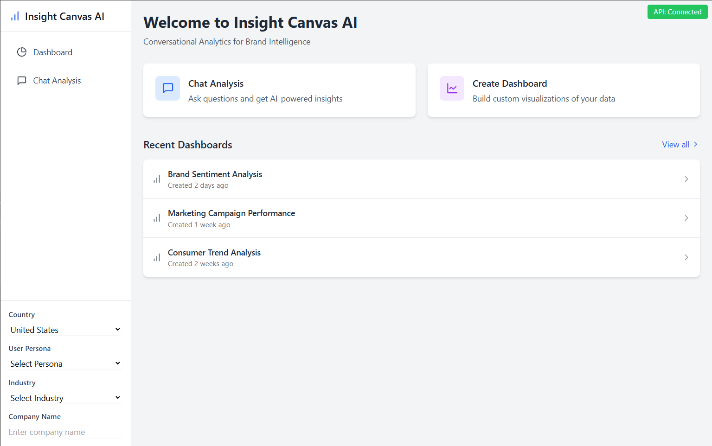
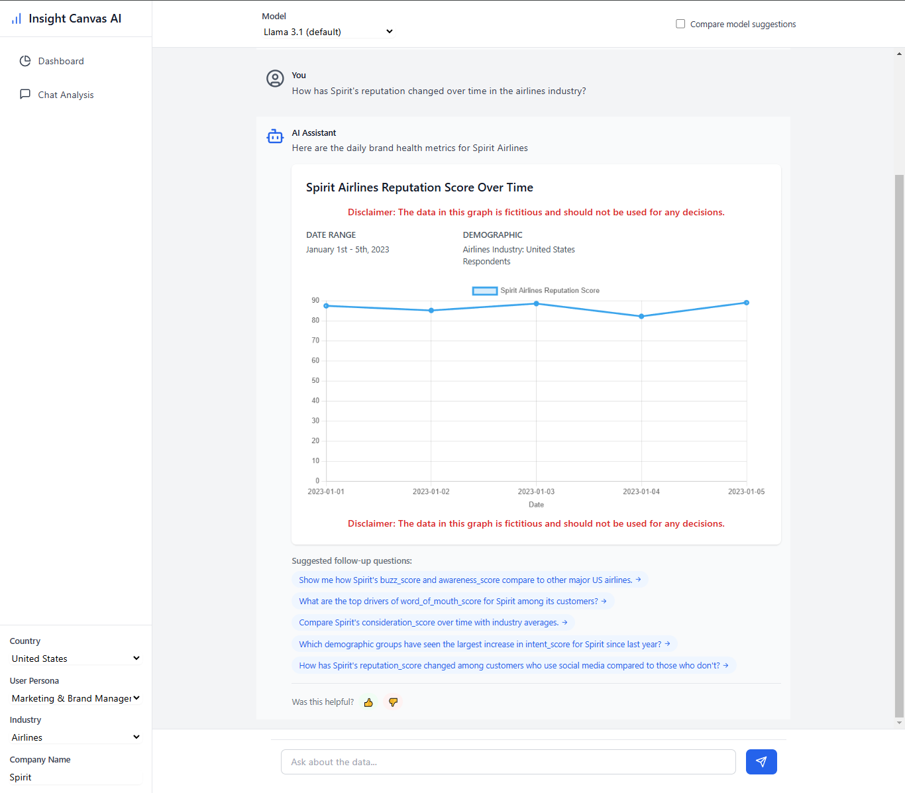
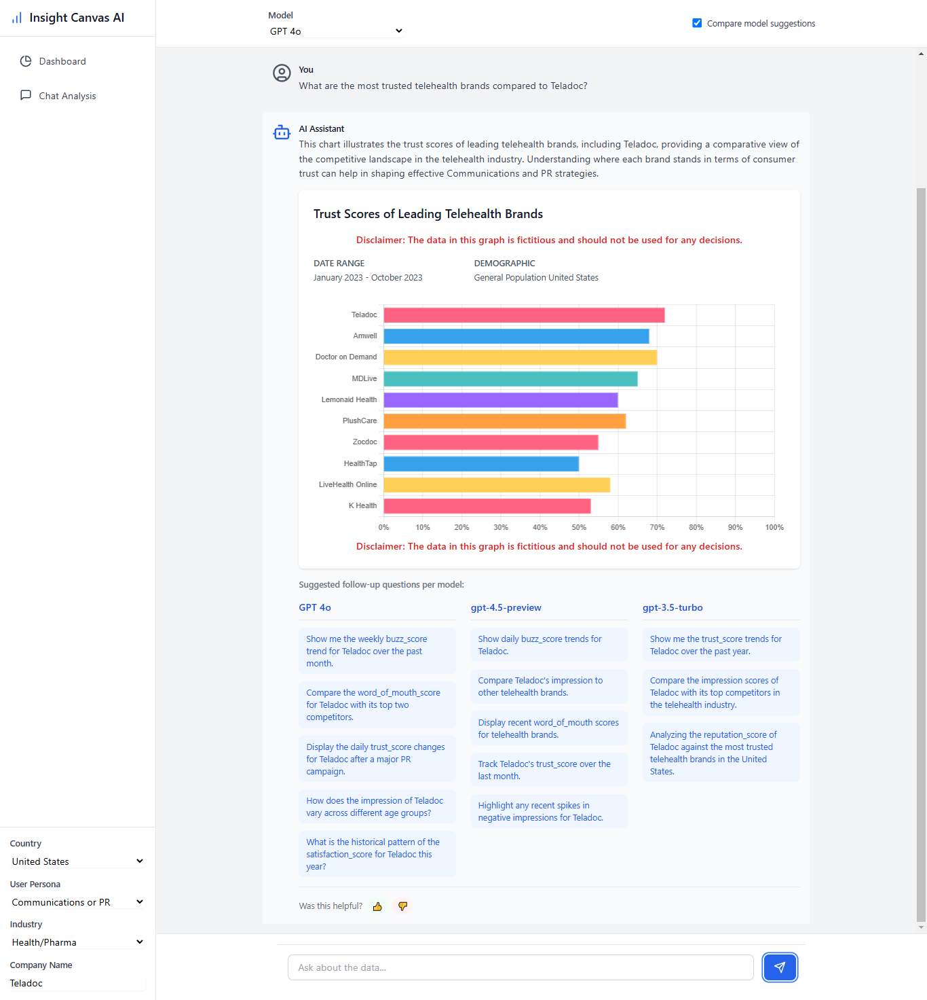
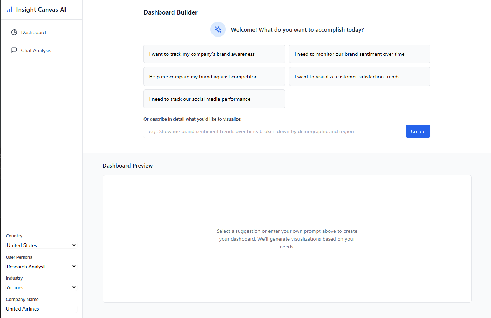

# Insight Canvas AI

A platform for conversational analytics on brand information. It focuses on brand sentiment findings, visual summaries, and AI-based insights.

## Project Purpose

I built this as an experiment after seeing new features from a market research company. My goal was to showcase how  Software as a Service (SaaS) companies with smaller user groups, such as research analysts, can keep clients from leaving by making the tool useful to a bigger set of users. If more roles (like Marketers, PR or Sales) rely on it, it is more likely to become part of their day-to-day process. That lowers the chance of losing a client if a key user, the research analyst, leaves.

Note: This is not a real product. It is just a test project to see how far different AI models can go in helping a user explore a brand sentiment dataset. The data shown in it is made-up. An LLM produces it on the fly.

To run this project you will need an access key from an OpenAI account with credits, and a locally running Ollama with Llama 3.1 running.

## Key Features

- **AI-powered Conversational Interface**: Interact with your brand data through natural language queries
- **Dynamic Data Visualizations**: Real-time chart generation using Chart.js
- **Multiple AI Model Support**: Includes support for Llama 3.1 and GPT-4o
- **Industry-specific and Persona-specific Analysis**: Tailored insights for various market sectors and user personas
- **Automated Dashboard Creation**: Generate complete dashboards from simple objective statements
- **Full-stack Architecture**: Built on Next.js with robust API functionality

## Screenshots

### Homepage



### Conversational Analytics Interface



*The AI-powered conversational interface allows users to get suggestions to further their exploration of the dataset.*

**Disclaimer: The data shown above is ficticious, an LLM generated it.**



*The app also supports using multiple models to compare the suggestions.*

**Disclaimer: The data shown above is ficticious, an LLM generated it.**

### Auto-generated Dashboard



*Example of the create dashboard experience.*


## Getting Started

### Prerequisites

- Node.js 18+ (recommended)
- NPM
- OpenAI API key
- Ollama with Llama 3.1 model installed locally

### Installation

1. Clone the repository
```bash
git clone https://github.com/xbito/xbito-insight-canvas-ai.git
cd xbito-insight-canvas-ai
```

2. Install dependencies
```bash
npm install
```

3. Set up environment variables
   - Copy `.env.local.example` to `.env.local`
   - Add your API keys and configuration:
   ```
   OPENAI_API_KEY=your_openai_key_here
   OLLAMA_BASE_URL=http://localhost:11434
   ```

4. Start the development server
```bash
npm run dev
```

5. Open [http://localhost:3000](http://localhost:3000) in your browser

## Supported AI Models

This application currently supports the following AI models:

- **Llama 3.1** - Meta's open-source language model running locally through Ollama
- **GPT 4o** - OpenAI's latest multimodal model for advanced reasoning and content generation
- **gpt-4o-mini** - OpenAI's smaller, more efficient version of GPT-4o
- **gpt-4-turbo** - OpenAI's enhanced model designed for complex reasoning tasks
- **gpt-3.5-turbo** - OpenAI's cost-effective model for general-purpose tasks
- **o1-mini** - OpenAI's compact and efficient reasoning model
- **o1-preview** - OpenAI's preview model with advanced reasoning capabilities
- **gpt-4.5-preview** - OpenAI's preview of next-generation non-reasoning model capabilities

### Environment Variables

Make sure to configure the following environment variables in your production environment:

- `OPENAI_API_KEY`
- `OLLAMA_BASE_URL` (if using Ollama in production)
- `NODE_ENV=production`

## Troubleshooting

### Common Issues

- **API Connection Errors**: Ensure your API keys are correctly set in `.env.local`
- **Ollama Connection Issues**: Check that Ollama is running locally on port 11434
- **Model Loading Problems**: Verify that you've downloaded the required models in Ollama

## Contributing

Contributions are welcome! Please feel free to submit a Pull Request.

## License

This project is licensed under the MIT License - see the LICENSE file for details.